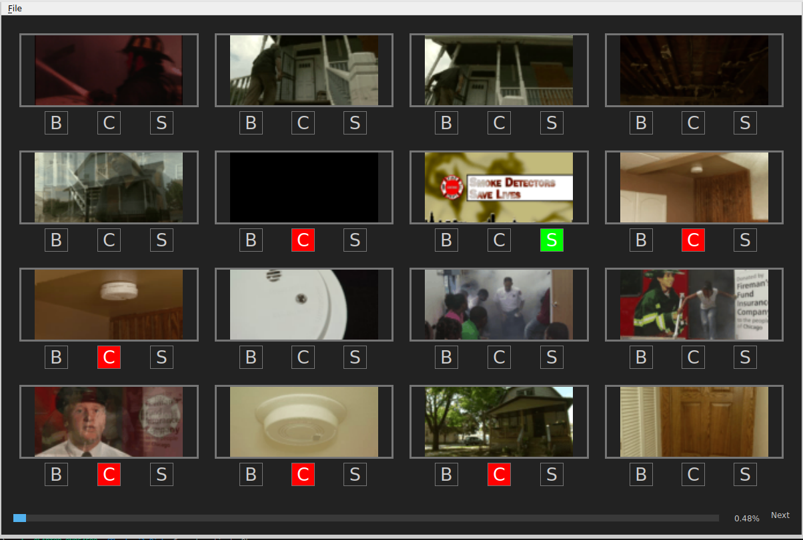

Thumbnail Picker
---
---


### GUI
Interface for selecting invalid sequences by inspecting thumbnails (.gif).

There are 4 classes:
1. **valid**: default class.
2. **border (B)**: there is border around image.
3. **scene cut (C)**: there is scene cut.
4. **screen content (S)**: there is screen content.

---
### Install
```bash
conda env create -f requirement/picker.yml
```

### Execute
```bash
python picker.py
```